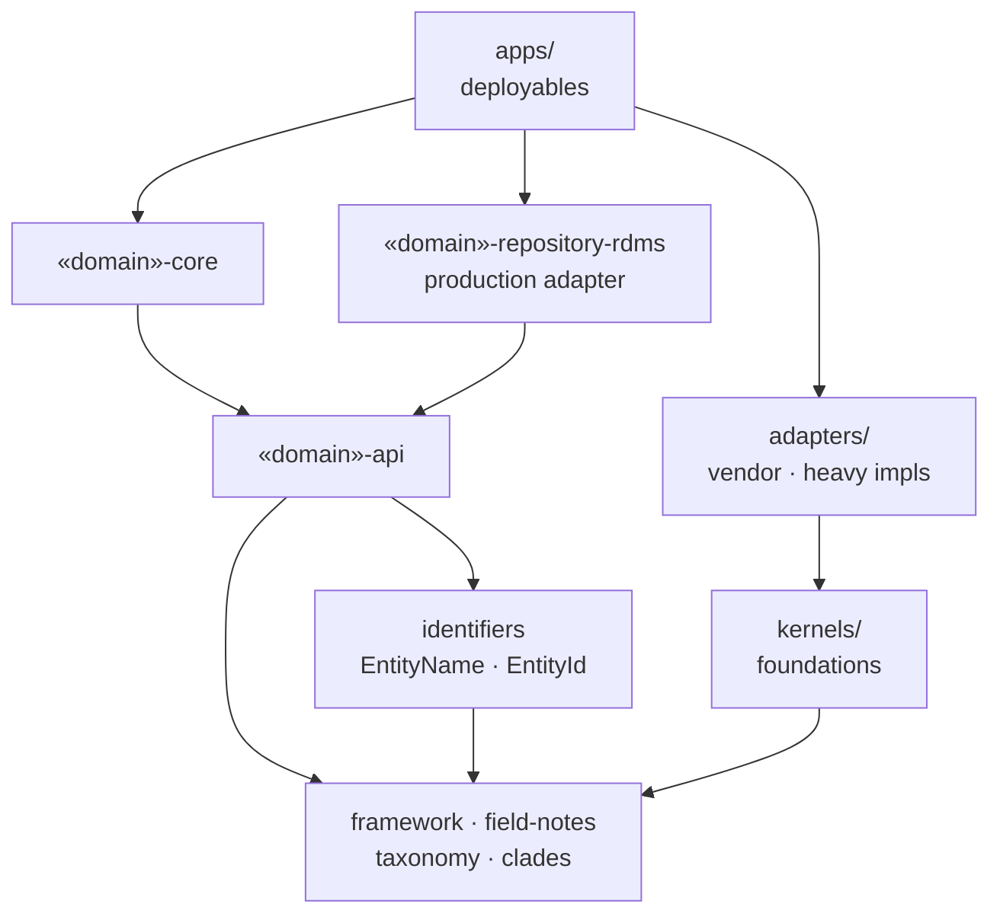
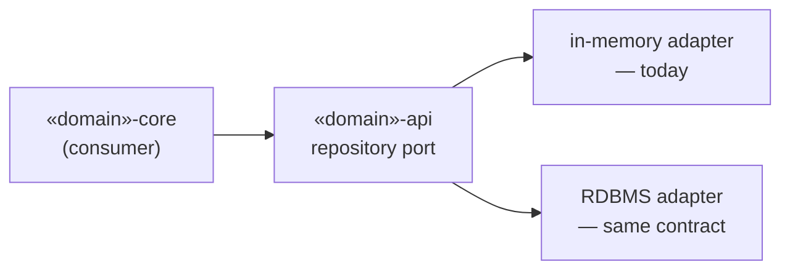
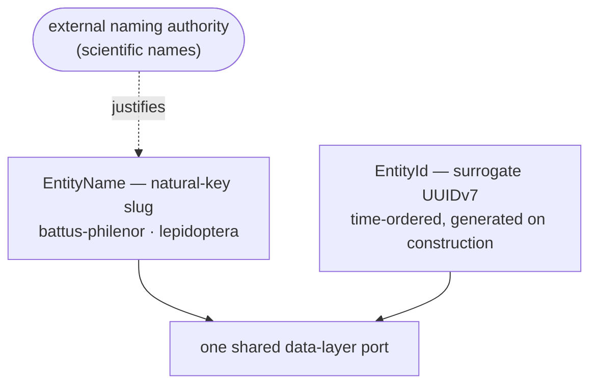

# Backyard Naturalist

A modular-monolith application for cataloging the living systems of a
small managed landscape — insects, plants, soil chemistry, garden,
sensors — built as a long-form study in **Domain-Driven Design, hexagonal
architecture, and structural enforcement**.

> **Portfolio note.** This codebase is deliberately a demonstration of
> structural choices: how a real domain is bounded, how identity is typed,
> how cross-boundary calls are governed, and how vendor concerns are kept out
> of the core. Every load-bearing decision is recorded as an
> [ADR](docs/adr/README.md), and the architecture is enforced by the build —
> not by convention.

---

## The idea in one minute

A naturalist works a real site — *Oak Vista*, near Chico, California — with
a garden, diverse organisms, soil chemistry, and ongoing field observations. This
application is the instrument: photograph an insect, have it identified to the
most specific rank the evidence supports, and file it in a catalog that
composes taxonomy, ecology, chemistry, and habitat into one navigable surface.

The focus is as much on the engineering discipline as on the subject matter. The
system is one deployable artifact today, but every domain is module-isolated and
references its peers only by typed names, so the shape is built to split. The
rules that make that possible are checked at compile time and by the test
suite, so the documented architecture and the running code cannot drift apart.

**What's built:** a vision-assisted insect identification pipeline, an
eleven-domain catalog, a four-level "explain-it-at-any-level" description on
every entity, a Spring Boot management console, and a build-time enforcement
layer — module DAG, N+1 query gate, resilience-coverage gate, and **ArchUnit +
OpenRewrite** architectural rules — that fails the build when an invariant is
violated.

---

## Architecture at a glance

| Tree | What lives there |
|------|------------------|
| `apps/` | composition roots — the deployable artifacts |
| `adapters/` | ports-and-adapters with heavy / vendor dependencies |
| `external-authorities/` | integrations with external data authorities (e.g. EOL) |
| `kernels/` | cross-cutting foundations (no domain knowledge) |
| `domains/` | bounded contexts — one module set per domain |
| `tooling/` | OpenRewrite architectural-enforcement recipes |

Each domain is split into coordinated Maven modules:

| Module | Role |
|--------|------|
| `<domain>-api` | public surface: entities, typed ids, query/command ports |
| `<domain>-core` | adapters: query impls, aggregate factories, services |
| `<domain>-repository-test` | in-memory adapter + the behavioral contract every adapter must satisfy |
| `<domain>-repository-rdms` | production persistence adapter (see note below) |
| `<domain>-console` | JTE view fragments contributed to the console |

The whole system is structured as a strict **directed acyclic graph** — every
dependency points one way, and a cycle cannot compile (enforced by Java module
visibility, verified by ArchUnit). `framework` sits at the bottom; nothing
depends on an app.

The deployable path runs through `-repository-rdms`. The `-repository-test`
adapter is a **test-scope** module: it satisfies the same repository contract but
is never on the production classpath, so it does not appear in the graph above.

Cross-domain references are typed names — an `InsectSpeciesName`, a `PlantSpeciesName` —
held in the shared, dependency-light **`identifiers`** module. A domain names its
peers through it without depending on their implementations, and it is where a
reference that would otherwise close a dependency cycle is broken instead. Domain
`-core` may also depend on another domain's `-api` — never its `-core`.
See [ADR-004 — Modular Monolith](docs/adr/ADR-004-modular-monolith.md).

> **Current state of persistence.** The `-repository-rdms` modules exist and
> satisfy the same behavioral contract as the in-memory adapter, but today they
> **delegate to the in-memory mock** — a deliberate, temporary state while the
> application is built out behind a stable port. Swapping in real RDBMS storage
> is a change behind the port, invisible to every consumer.

---

## Built to move fast — and to scale

The architecture is not tidy for its own sake. It is optimized for the people
and AI agents building on it, for the load it will carry in production, and to
be run and *afforded* by a single engineer.

- **Sub-minute builds.** Because the data layer is in-memory, the full
  `mvn verify` — every module, every behavioral contract, every invariant walk —
  completes in **under a minute**. The feedback loop stays tight enough to run
  constantly, which is what makes strict enforcement livable rather than a tax.
- **Designed to scale.** Keeping repositories as simple entity caches and
  composing results with **batched, set-based selects** in memory scales more
  predictably than complex relational joins. A batched lookup against a key-value
  cache has near-constant, sharding-friendly cost; a multi-join query degrades
  unpredictably as data and load grow. Composition cost lives in explicit
  application code, not a query planner — and the N+1 gate keeps it batched.
- **Affordable to run solo — resilience as a cost control.** The system is meant
  to be operated and paid for by one engineer, where a surprise cloud or AI
  bill would be catastrophic. So every cross-boundary and vendor/LLM call is
  wrapped in **timeouts, circuit breakers, and declared rate limits**, and
  production adapters refuse to run on missing config rather than silently
  falling back. A wedged provider, a runaway loop, or an unbounded model spend is
  contained by design, not discovered on an invoice.
- **Observed, not logged.** Every call site is observed through the framework's
  metering — and there is deliberately **no logging**: nothing to grep, no log
  pipeline to host or pay for. Failures surface as metrics that **alert the
  engineer directly**, and the metric pinpoints the exact **class, method, and
  variable** behind the violated runtime constraint — so the notification is the
  diagnosis, not just a signal to go digging. For a one-person operation, that
  keeps monitoring tractable — a failure announces itself, already located.
- **Strong types are guardrails for AI agents.** Typed identifiers, the
  one-of-five supertype rule, and the enforced module DAG give a coding agent
  unambiguous rails. The compiler and the enforcement layer flag a wrong turn
  immediately, so agents are steered toward consistent, correct-by-construction
  code rather than plausible-looking drift — and the repeated patterns mean an
  agent that has seen one domain can extend the next.
- **The real-world model stays in the foreground.** The API is designed so a
  engineer writes about insects, soil, and the garden — not about persistence
  wiring, serialization, or validation ceremony. Namespaces, read-model
  factories, and the invariant framework absorb the plumbing, leaving the
  domain itself as the thing you actually edit.

---

## What makes it interesting

Three ideas carry most of the engineering weight; they are the ones worth
reading first.

### Hexagonal — and strongly typed end to end

The core carries **zero vendor dependencies**: kernels and domain code know
nothing of Spring, Resilience4j, or any database. Everything heavy or
vendor-specific sits behind a kernel facade or a port in `adapters/`, so an
implementation swaps without a consumer noticing. The data layer is the proof:
today every repository is an in-memory cache, and a **single behavioral
contract** — defined once as a `@Test` interface and implemented by both the
in-memory adapter and the future RDBMS one — guarantees their equivalence by
construction, so the swap to a real database is invisible to every consumer.
Types are precise the whole way down — a raw `String` or `UUID` at a boundary is
a review blocker — so the ports stay narrow: the discipline that lets the system
scale, and lets an AI agent extend it with less guesswork.

→ [ADR-001 (repositories)](docs/adr/ADR-001-repository-architecture.md),
[ADR-002 (contract)](docs/adr/ADR-002-repository-behavioral-contract.md)

### Observability is structural, not bolted on

Every domain type declares `invariants()` — a pure predicate graph the framework
walks at method boundaries, on repository inserts, on query results, and on
event processing. A single walk returns the **complete** set of violations in
one pass (no debugging which constraint tripped first), and emits Micrometer
meters with stable, normalized names. Cardinality lives in the **tags, not the
metric names**, so the meter set stays bounded no matter how much data flows —
the class, method, and variable behind a violation ride tags on a small, fixed
set of meters. No domain class ever imports Micrometer. Validation, monitoring,
and a type's structural self-description collapse into one declaration that lives
on the type itself.
→ [ADR-017](docs/adr/ADR-017-observability-monitoring-and-validation.md)

### An identity model that earns its keys

There are exactly **two strategies** behind one shared data-layer port: a
natural-key **slug** (`EntityName`) and a surrogate **UUIDv7** (`EntityId`).

The slug is the stable, cross-domain reference — `battus-philenor`, `lepidoptera`
— and it is sound precisely because taxonomy has an **external naming authority**:
scientific names are already stable, unique, and curated by the world outside
this system, so the slug is a genuine natural key, not one invented for
convenience. Where no such authority exists, the **UUIDv7** strategy takes over —
time-ordered, generated at construction, and never crossing a domain boundary by
value. That two-sidedness is the whole point: natural keys where an authority
earns them, surrogate keys everywhere else. Every cross-domain reference travels
as one of these typed names, so domains couple by identity alone and never by a
cross-domain join — which is what keeps a single deployable honestly ready to
split.

→ [ADR-022 (identity model)](docs/adr/rationale/ADR-022-entity-identity-unified.md),
[ADR-001 (references by name)](docs/adr/ADR-001-repository-architecture.md)

### And the rest is enforced too

| Decision | In short |
|----------|----------|
| **[One of five framework supertypes](kernels/framework/README.md)** | Every domain class is exactly one of `NamedEntity`, `Entity`, `Aggregate`, `ReadModel`, `ValueObject` (or a `BehavioralCollection`). The choice dictates identity, equality, and lifecycle. No escape hatch. |
| **[Resilience is declared, not assumed](docs/adr/ADR-026-resilience-first-order-concern.md)** | Every cross-boundary call site declares a strategy or an explicit exemption; a build-time gate fails when one declares neither, and production adapters refuse to run on missing config. |
| **[Command/Query separation at the surface](docs/adr/ADR-020-namespace-interface-pattern.md)** | Read and write paths are distinct types, organized into three coordinated namespaces per domain, with visibility (`class` vs `interface`) chosen to hide repository contracts and expose the consumer surface. |
| **[Small, reviewable PRs](docs/adr/ADR-019-pull-request-size-and-review-fatigue.md)** | One concern per PR, targeting a diff a reviewer can hold in working memory — so domain-model mistakes get caught, not waved through. |

---

## Module map

The specifics live with the code. Each module below has its own README.

### Domains

| Domain | What it models |
|--------|----------------|
| [insects](domains/insects/README.md) | Reference organism domain — Linnaean hierarchy, vision-assisted identification, field observations, features, life stages |
| [plants](domains/plants/README.md) | Botanical catalog mirroring the insects evidence stack — ranks, images, features, roles |
| [chemistry](domains/chemistry/README.md) | Compounds, elements, and chemical properties referenced across domains |
| [soil](domains/soil/README.md) | Soil chemistry, exchangeable-cation optima, amendment history |
| [garden](domains/garden/README.md) | Plantings and planted zones — the cultivated layer over the wild catalog |
| [naturalists](domains/naturalists/README.md) | The observers themselves — identity, authentication, attribution |
| [library](domains/library/README.md) | Citations and external-authority references binding claims to sources |
| [sensors](domains/sensors/README.md) | Environmental sensor definitions and readings |
| [climate](domains/climate/README.md) | Microclimate thresholds and observations |
| [apiary](domains/apiary/README.md) | Beekeeping records |
| [zone](domains/zone/README.md) | Geographic zones and site structure |

Skeletal organism domains awaiting activation — [arachnids](domains/arachnids/README.md),
[fungi](domains/fungi/README.md), [microbes](domains/microbes/README.md),
[molluscs](domains/molluscs/README.md), [vertebrates](domains/vertebrates/README.md),
[worms](domains/worms/README.md), [weather](domains/weather/README.md) — carry the
same blueprint and are documented as planned.

Alongside the bounded contexts, the `domains/identifiers` module holds the typed
`EntityName`/`EntityId` reference names for every domain — the shared, narrow seam
through which domains reference one another by name (see the
[dependency graph](#architecture-at-a-glance) above).

### Kernels

| Kernel | What it provides |
|--------|------------------|
| [framework](kernels/framework/README.md) | The DDD building blocks — supertypes, typed identity, observability, the resilience facade, the DI marker |
| [framework-test](kernels/framework-test/README.md) | Test infrastructure — `TestEntitySource`, the in-memory database, the behavioral-contract harness, the N+1 gate |
| [field-notes](kernels/field-notes/README.md) | The Durrell four-level `Description` attached to every describable entity |
| [taxonomy](kernels/taxonomy/README.md) | Linnaean classification and cross-rank ancestry for organism domains |
| [clades](kernels/clades/README.md) | The evolutionary tree of life as a sealed, curated vocabulary |
| [catalog](kernels/catalog/README.md) + [catalog-inmem](kernels/catalog-inmem/README.md) | Cross-domain reference resolution by slug, with an in-process fan-out adapter |
| [observation](kernels/observation/README.md) | Generic organism observation and image records shared across organism domains |
| [authority](kernels/authority/README.md) | The external-authority seam (e.g. Encyclopedia of Life) behind a port |
| [habitat](kernels/habitat/README.md) + [biogeography](kernels/biogeography/README.md) | Habitat profiles and bioregion vocabularies |
| [measurements](kernels/measurements/README.md) | Typed quantities and units used across the catalog |
| [feature-search](kernels/feature-search/README.md) | Reuse-aware feature matching for identification |
| [vision](kernels/vision/README.md) + [text-generation](kernels/text-generation/README.md) | LLM-backed ports for image identification and description generation |

### Adapters & apps

| Module | Role |
|--------|------|
| [management-console](apps/management-console/README.md) | Spring Boot fat jar — composes every active domain into one UI |
| [resilience-resilience4j](adapters/resilience-resilience4j/) | Vendor adapter for the kernel `Resilience` facade |
| [spring-runtime](adapters/spring-runtime/) | Turns the `@DomainService` marker into Spring bean discovery |
| [anthropic-vision](adapters/anthropic-vision/) + [anthropic-text-generation](adapters/anthropic-text-generation/) | LLM adapters behind the `vision` and `text-generation` ports |

---

## Tech stack

- **Java 25**, no Lombok, JSpecify nullability annotations.
- **Maven multi-module** — strict module DAG; Java visibility is the primary
  boundary, ArchUnit the build-time backstop.
- **Spring Boot 3.5** — composition root only, behind the `spring-runtime`
  adapter and the `@DomainService` marker.
- **JTE** for server-rendered console templates.
- **Micrometer** for metrics, emitted only via the kernel's builder.
- **Resilience4j** behind the kernel's `Resilience` facade.
- **Jackson** for record-native serialization.
- **OpenRewrite + ArchUnit** for repo-wide architectural enforcement.

---

## Documentation index

- [Architecture Decision Records](docs/adr/README.md) — the recorded design rationale.
- [`CLAUDE.md`](CLAUDE.md) — top-level conventions and identity model.
- [`docs/briefings/`](docs/briefings/README.md) — short context briefings per domain.
- [`docs/resilience-policy.md`](docs/resilience-policy.md) — cross-boundary resilience policy.
- [`docs/measurement-standards.md`](docs/measurement-standards.md) — units across the catalog.
- [Management Console README](apps/management-console/README.md) — running the console, login, theming.

---

## License

Proprietary — Copyright (c) 2026 Patrick Way. All rights reserved.
See [`LICENSE`](LICENSE).
