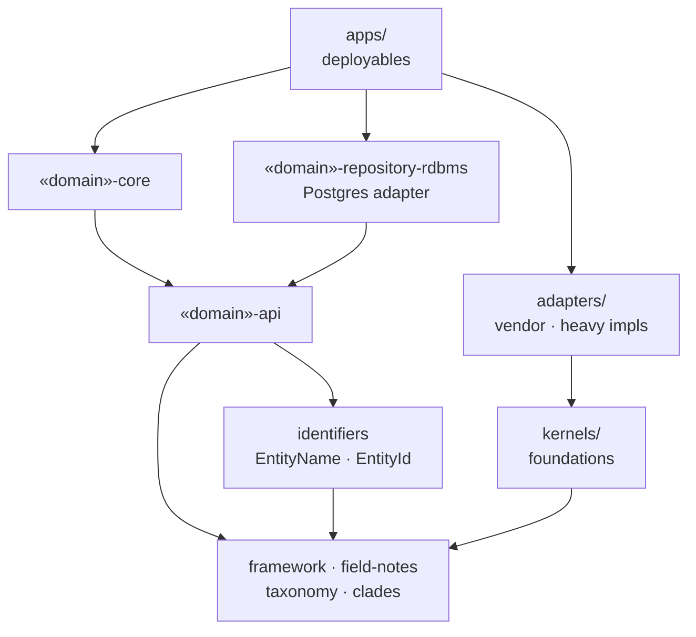
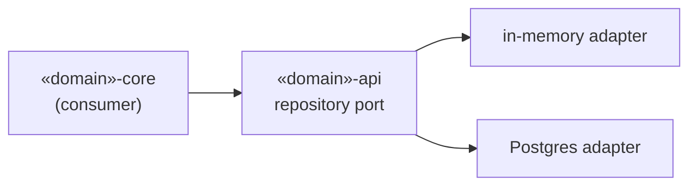
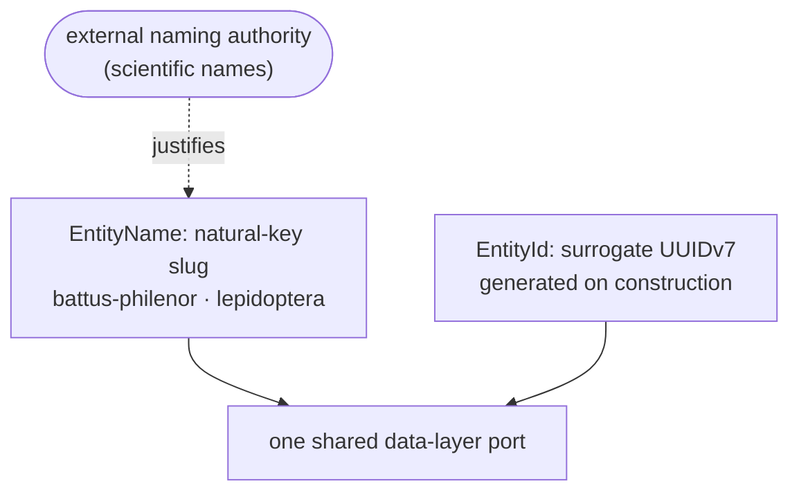

# Naturalist

A Java 25 modular monolith for cataloging the living systems of one backyard:
insects, plants, soil chemistry, the garden, and more. Photograph an insect,
have a vision model identify it to the most specific rank the evidence
supports, and file it in a catalog that ties together taxonomy, ecology,
chemistry, and habitat.

The subject is a hobby. The engineering is the point: a long-form study in
**Domain-Driven Design, hexagonal architecture, and structural enforcement**,
where every load-bearing decision is recorded as an [ADR](docs/adr/README.md)
and the architecture is enforced by the build, not by convention.

This project is built with Claude Code, under a process that enforces the
architecture with ArchUnit and OpenRewrite and records decisions as ADRs.

---

## State

A working personal project, not a product.

- **Runs:** a Spring Boot 4 management console (server-rendered JTE) with
  anonymous browsing, email login, and vision-assisted insect identification
  gated behind a per-account permission and a usage budget.
- **Persists:** Postgres via MyBatis for nine domains (insects, plants,
  chemistry, soil, garden, library, naturalists, accounts, usage). The other
  domains run on in-memory adapters that satisfy the same repository contract.
- **Not yet:** hosted deployment. There is no container or deploy config.
  When a host is chosen, the static Anthropic API key is planned to give way
  to Workload Identity Federation, so no long-lived secret is stored.

## Where to look first

1. **[`domains/insects/`](domains/insects/)**, the reference domain the others
   follow. The layout is explained [below](#architecture-at-a-glance).
2. **Two ADRs:** [ADR-004, Modular monolith](docs/adr/ADR-004-modular-monolith.md)
   and [ADR-002, Repository behavioral contract](docs/adr/ADR-002-repository-behavioral-contract.md).
3. **The identification pipeline**, from upload to filed record:
   - [`InsectsController`](domains/insects/insects-console/src/main/java/com/naturalist/insects/InsectsController.java):
     `POST /insects/identify` takes the photo.
   - [`InsectIdentificationCommand`](domains/insects/insects-core/src/main/java/com/naturalist/insects/InsectIdentificationCommand.java):
     the orchestrator. Rate gate, budget reservation, vision, authority and
     parent-rank enrichment, feature resolution, citations, then one
     transactional write.
   - [`VisionService`](kernels/vision/src/main/java/com/naturalist/vision/VisionService.java)
     is the port;
     [`AnthropicVisionService`](adapters/anthropic-vision/src/main/java/com/naturalist/vision/anthropic/AnthropicVisionService.java)
     is the adapter: multi-turn tool use with prompt caching, behind timeouts
     and a circuit breaker. A second turn uses
     [`FeatureSearch`](kernels/feature-search/src/main/java/com/naturalist/featuresearch/FeatureSearch.java)
     to reuse existing features instead of duplicating them.
4. **The enforcement layer:** ArchUnit rules in
   [`apps/management-console/.../architecture/`](apps/management-console/src/test/java/com/naturalist/console/architecture/),
   OpenRewrite recipes in [`tooling/naturalist-rewrite/`](tooling/naturalist-rewrite/),
   and a runtime N+1 query gate in the test extension.

---

## Architecture at a glance

| Tree | What lives there |
|------|------------------|
| `apps/` | composition roots, the deployable artifacts |
| `adapters/` | ports-and-adapters with heavy or vendor dependencies |
| `external-authorities/` | integrations with external data authorities (e.g. EOL) |
| `kernels/` | cross-cutting foundations with no domain knowledge |
| `domains/` | bounded contexts, one module set per domain |
| `tooling/` | OpenRewrite architectural-enforcement recipes |

Each domain is split into coordinated Maven modules:

| Module | Role |
|--------|------|
| `<domain>-api` | public surface: records, typed ids, query and command ports |
| `<domain>-core` | query implementations, aggregate factories, commands |
| `<domain>-repository-test` | in-memory adapter plus the contract every adapter must pass |
| `<domain>-repository-rdbms` | Postgres/MyBatis adapter, held to the same contract |
| `<domain>-console` | the JTE views this domain contributes to the console |

The system is a strict **directed acyclic graph**: every dependency points one
way, and a cycle cannot compile. Java visibility is the primary boundary and
ArchUnit the build-time backstop. A domain's `-core` may depend on another
domain's `-api`, never its `-core`; cross-domain references are typed names
held in the dependency-light `identifiers` module.



---

## Built to move fast, and to scale

The architecture is not tidy for its own sake. It is optimized for the people
and AI agents building on it and for the load it will carry.

- **A one-minute feedback loop.** The full `mvn verify` (every module, every
  behavioral contract, every architecture gate) runs in about a minute. That
  keeps strict enforcement livable instead of a tax.
- **Designed to scale.** Repositories are simple entity caches, and results
  are composed from **batched, set-based selects** rather than multi-table
  joins. A batched key lookup has predictable, sharding-friendly cost; a join
  degrades unpredictably as data grows. The N+1 gate keeps composition batched.
- **Cost-bounded by design.** The app calls a paid vision model, so runaway
  spend is treated as a failure mode. Each identification reserves against a
  per-account usage budget, every vendor call runs behind timeouts, circuit
  breakers, and rate limits, and production adapters refuse to start on
  missing configuration rather than silently falling back. A stuck provider or
  a runaway loop hits a limit, not an invoice.
- **Observed, not logged.** Every call site is metered through the framework,
  and there is deliberately no logging. A violated invariant surfaces as a
  metric that names the exact class, method, and variable involved, so the
  alert is the diagnosis.
- **Strong types are guardrails for AI agents.** Typed identifiers, the
  one-of-five supertype rule, and the enforced module DAG give a coding agent
  unambiguous rails. The compiler and the enforcement layer flag a wrong turn
  immediately, and the repeated patterns mean an agent that has seen one
  domain can extend the next.
- **The domain stays in the foreground.** Namespaces, read-model factories,
  and the invariant framework absorb persistence, serialization, and
  validation plumbing, so the code you edit is about insects, soil, and the
  garden.

---

## Three ideas worth knowing

### Hexagonal, and strongly typed end to end

The core has **zero vendor dependencies**: kernels and domain code know
nothing of Spring, Resilience4j, or the database. Every repository port has a
**single behavioral contract**, written once as a JUnit `@Test` interface and
implemented by both the in-memory adapter and the Postgres adapter, so the two
are interchangeable by construction. A raw `String` or `UUID` at a boundary is
a review blocker, which keeps ports narrow.



Read more: [ADR-001 (repositories)](docs/adr/ADR-001-repository-architecture.md),
[ADR-002 (contract)](docs/adr/ADR-002-repository-behavioral-contract.md).

### Observability is structural, not bolted on

Every domain type declares `invariants()`, a predicate graph the framework
walks at method boundaries, on repository writes, and on query results. One
walk returns **every** violation at once and emits Micrometer meters whose
cardinality lives in tags, not names, so the meter set stays bounded. No
domain class imports Micrometer: validation, monitoring, and the type's
self-description are one declaration on the type itself.

Read more: [ADR-017](docs/adr/ADR-017-observability-monitoring-and-validation.md).

### An identity model that earns its keys

There are exactly **two identity strategies** behind one data-layer port. A
natural-key **slug** (`battus-philenor`, `lepidoptera`) is used where an
external naming authority, like scientific nomenclature, already guarantees
stable, unique names. A time-ordered **UUIDv7** is used everywhere else and
never crosses a domain boundary. Domains couple by typed name only, never by a
cross-domain join, which is what keeps one deployable honestly ready to split.



Read more: [ADR-022 (identity model)](docs/adr/rationale/ADR-022-entity-identity-unified.md).

### And the rest is enforced too

| Decision | In short |
|----------|----------|
| **[One of five framework supertypes](kernels/framework/README.md)** | Every domain class is exactly one of `NamedEntity`, `Entity`, `Aggregate`, `ReadModel`, `ValueObject` (or a `BehavioralCollection`), which fixes its identity, equality, and lifecycle. |
| **[Resilience is declared, not assumed](docs/adr/ADR-026-resilience-first-order-concern.md)** | Every cross-boundary call declares a strategy or an explicit exemption; the build fails when one declares neither. |
| **[Command/Query separation at the surface](docs/adr/ADR-020-namespace-interface-pattern.md)** | Read and write paths are distinct types, organized into coordinated namespaces per domain. |
| **[Small, reviewable PRs](docs/adr/ADR-019-pull-request-size-and-review-fatigue.md)** | One concern per PR, sized so a reviewer can hold the diff in working memory. |

---

<details>
<summary><strong>Module map</strong> (every module has its own README)</summary>

### Domains

| Domain | What it models |
|--------|----------------|
| [insects](domains/insects/README.md) | Reference organism domain: Linnaean hierarchy, vision-assisted identification, observations, features, life stages |
| [plants](domains/plants/README.md) | Botanical catalog mirroring the insects evidence stack |
| [chemistry](domains/chemistry/README.md) | Compounds, elements, and chemical properties referenced across domains |
| [soil](domains/soil/README.md) | Soil chemistry, exchangeable-cation optima, amendment history |
| [garden](domains/garden/README.md) | Plantings and planted zones, the cultivated layer over the wild catalog |
| [naturalists](domains/naturalists/README.md) | The observers: profile and attribution |
| [accounts](domains/accounts/) | Authentication accounts, login by email, permission grants |
| [usage](domains/usage/) | Identification budget: usage events, counters, rate limits |
| [library](domains/library/README.md) | Citations binding claims to external sources |
| [sensors](domains/sensors/README.md) | Environmental sensor definitions and readings |
| [climate](domains/climate/README.md) | Microclimate thresholds and observations |
| [apiary](domains/apiary/README.md) | Beekeeping records |
| [zone](domains/zone/README.md) | Geographic zones and site structure |

Skeletal organism domains awaiting activation, built on the same blueprint:
[arachnids](domains/arachnids/README.md), [fungi](domains/fungi/README.md),
[microbes](domains/microbes/README.md), [molluscs](domains/molluscs/README.md),
[vertebrates](domains/vertebrates/README.md), [worms](domains/worms/README.md),
[weather](domains/weather/README.md).

### Kernels

| Kernel | What it provides |
|--------|------------------|
| [framework](kernels/framework/README.md) | DDD building blocks: supertypes, typed identity, observability, resilience facade, DI marker |
| [framework-test](kernels/framework-test/README.md) | `TestEntitySource`, the in-memory database, the contract harness, the N+1 gate |
| [field-notes](kernels/field-notes/README.md) | The four-level `Description` attached to every describable entity |
| [taxonomy](kernels/taxonomy/README.md) | Linnaean classification and cross-rank ancestry |
| [clades](kernels/clades/README.md) | The evolutionary tree of life as a sealed, curated vocabulary |
| [catalog](kernels/catalog/README.md) + [catalog-inmem](kernels/catalog-inmem/README.md) | Cross-domain reference resolution by slug |
| [observation](kernels/observation/README.md) | Generic organism observation and image records |
| [authority](kernels/authority/README.md) | The external-authority seam (e.g. Encyclopedia of Life) |
| [habitat](kernels/habitat/README.md) + [biogeography](kernels/biogeography/README.md) | Habitat profiles and bioregion vocabularies |
| [measurements](kernels/measurements/README.md) | Typed quantities and units |
| [feature-search](kernels/feature-search/README.md) | Reuse-aware feature matching for identification |
| [vision](kernels/vision/README.md) + [text-generation](kernels/text-generation/README.md) | LLM-backed ports for identification and description generation |

### Adapters and apps

| Module | Role |
|--------|------|
| [management-console](apps/management-console/README.md) | Spring Boot fat jar composing every active domain into one UI |
| [test-db-seeder](apps/test-db-seeder/) | Seeds the local Postgres from the domain catalogs |
| [resilience-resilience4j](adapters/resilience-resilience4j/) | Vendor adapter for the kernel `Resilience` facade |
| [spring-runtime](adapters/spring-runtime/) | Turns the `@DomainService` marker into Spring bean discovery |
| [anthropic-vision](adapters/anthropic-vision/) + [anthropic-text-generation](adapters/anthropic-text-generation/) | LLM adapters behind the `vision` and `text-generation` ports |

</details>

---

## Running it

Requires Java 25, Maven, and a local Postgres at
`localhost:5432/naturalist_test` (user `postgres`), seeded with
[`apps/test-db-seeder`](apps/test-db-seeder/).

```bash
mvn install
```

```bash
java -jar apps/management-console/target/management-console-1.0.0-SNAPSHOT.jar --naturalist.admin.username=admin --naturalist.admin.password=change-me
```

Set `ANTHROPIC_API_KEY` to enable identification; without it the vision port
falls back to a no-op.

## Tech stack

Java 25 (records, no Lombok, JSpecify) · Maven multi-module · Spring Boot 4 as
composition root only · JTE · PostgreSQL + MyBatis · Resilience4j behind a
kernel facade · Micrometer · Jackson · ArchUnit · OpenRewrite · Anthropic API.

## Documentation

- [Architecture Decision Records](docs/adr/README.md)
- [`CLAUDE.md`](CLAUDE.md): top-level conventions and identity model
- [`docs/briefings/`](docs/briefings/README.md): short context briefings per domain
- [`docs/resilience-policy.md`](docs/resilience-policy.md): cross-boundary resilience policy
- [`docs/measurement-standards.md`](docs/measurement-standards.md): units across the catalog

## License

Copyright 2026 Patrick Way. Licensed under the
[Apache License, Version 2.0](LICENSE).
