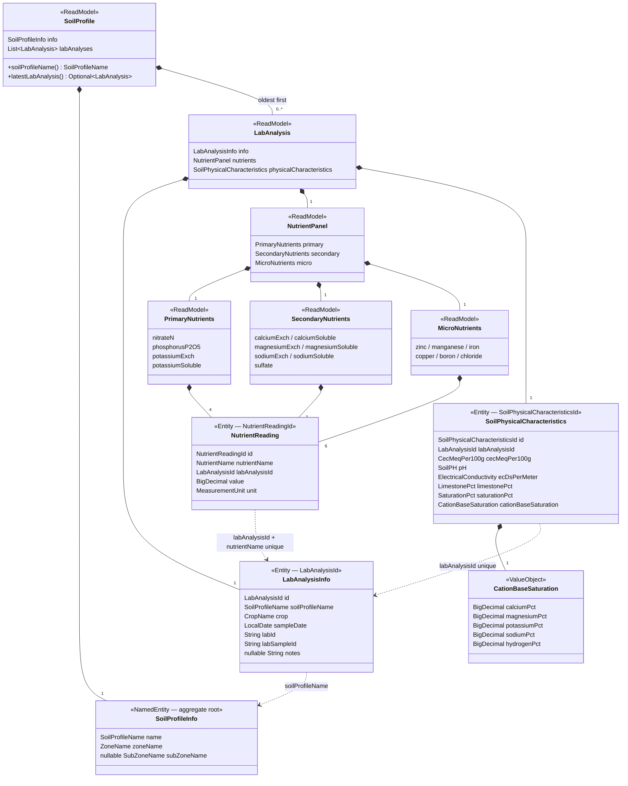
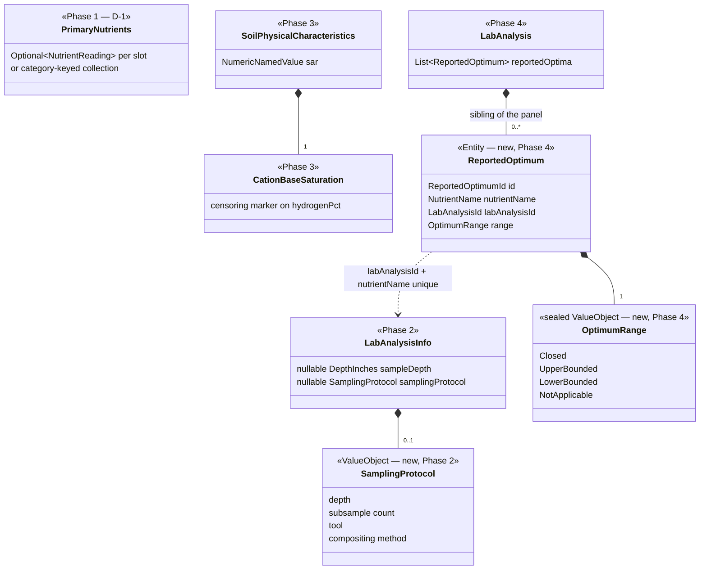

# Soil Status — Implementation Plan

**Rationale reference:** `soil-status-placement-brief.md` (arguments, rejected
alternatives). This document sequences the work; it does not re-argue it.
**Context reference:** `docs/briefings/soil-domain.md` (2026-08-10).
**Hard deadline:** August FGL report, lettuce panel, samples collected week of
2026-08-17.

Each phase below is sized for one Claude Code session. Hand the session this
plan's phase section, `soil-domain.md`, and the named brief section — not the
whole brief.

---

## The model today

What the phases below are editing. Solid diamonds are composition (assembled on
read); dashed arrows are the persisted foreign keys the assembly joins on.
`*Info` = persisted fact; bare noun = read model composed by
`SoilProfileFactory` and never stored.



Soft cross-domain references, carried by name and never imported: `zoneName` /
`subZoneName` into the zone domain, `crop` into the not-yet-existing garden
domain. `SubZone.soilProfileName` is the reverse edge, maintained by the
application layer.

The seventeen `NutrientReading` rows an FGL tomato panel produces are the four +
seven + six slots above. **That count is exactly what Phase 1 is about:** the
three grouping read models name a closed list, and `assemblePanel` fills each
slot with `byName.get(...)` — a lettuce panel with a different row set lands as
nulls in a graph whose invariants forbid them.

## What the phases change

Same graph, only the touched types. Nothing before Phase 4 adds an entity.



Read the Phase 4 edge literally: `ReportedOptimum` hangs off `LabAnalysis`
beside the panel, **not** as a component of `NutrientReading`. Putting a range
on the reading fuses measurement with interpretation and violates §18.

Phases 5–8 do not appear because they add nothing to this graph. Phase 5 is the
same sibling shape as Phase 4 for recommendations; Phase 7 moves constraints
into the read model without changing its components; Phase 8's `CropProfile`
lives in a peer module and applies over this graph rather than joining it.

Phase 0 (the D-2 collapse) changes no type at all — it deletes rows. Two
`SoilProfileInfo`s instead of four, `subZoneName` null on both, one
`LabAnalysis` each.

---

## Gate: two decisions to make before any session starts

Neither is a coding decision, and a session handed the brief will pick one
silently. Decide first, record the choice in the phase, then start.

> **Decided 2026-08-14.**
> **D-1 — `Optional` slots.** As recommended below.
> **D-2 — neither option: collapse the backyard.** See the revised Phase 6.

**D-1 — Panel shape.** Fixed `PrimaryNutrients` / `SecondaryNutrients` /
`MicroNutrients` slots go `Optional`, *or* the three read models give way to a
category-keyed collection.

The trade: `Optional` is a small diff and preserves the named-accessor
ergonomics the console templates already use, but keeps a closed list that
must be edited whenever a lab changes a panel. The category-keyed collection
matches the open, slug-keyed grain already chosen for `NutrientReading` and
survives new labs, but every template touching `panel.primary().nitrateN()`
changes.

Recommendation: `Optional` now, category-keyed later if a second lab or a
third panel appears. Reversible, and the deadline is real.

**D-2 — Backyard trio.** Model the shared sample explicitly
(`LabSample` entity, migration), or surface it in the view only.

Recommendation: view-only for now. The model duplication is honest enough as
long as the UI never implies three independent measurements, and a `LabSample`
migration is not something to run the week new data arrives.

**Decided: collapse instead.** Both options above answer the wrong question.
Three profiles exist because the sub-zones were modelled as soil profiles; the
sample was never split, and there will never be budget to split it. The
sub-zones are crop rows — a planting concern, not a soil-sampling one. So
`backyard-north` / `-center` / `-south` become one zone-scoped `backyard`
profile carrying the single `CH 2671853-002` analysis, and the duplicated rows
(three identical physical-characteristics rows, 51 of 68 nutrient readings)
leave the catalog. This deletes the problem Phase 6 was going to describe, and
`SubZone.soilProfileName` is already `@Nullable`, so the crop-row sub-zones
simply carry no profile.

Done first, before Phases 1–3: it halves the fixture surface those phases
migrate.

---

## Phase 1 — Panel tolerance (blocks August ingest)

**Brief §5.1. Depends on D-1. Implemented 2026-08-14.**

The August report cannot be loaded at all if FGL's lettuce panel differs from
the seventeen tomato-panel rows. This is the only phase with a hard external
deadline.

- Apply D-1 to `PrimaryNutrients`, `SecondaryNutrients`, `MicroNutrients`.
- Relax the `namedEntity(...)` invariants correspondingly.
- `SoilProfileFactory.assemblePanel` already uses `byName.get(...)` and yields
  null for a missing slot — under `Optional` that becomes the intended path,
  not a latent bug.
- Both existing fixtures stay complete (four before the Phase 0 collapse); add
  one deliberately-incomplete analysis to prove assembly survives it. It is
  built in the factory test rather than added to the shared JSON catalog —
  there is no real incomplete report until August, and the catalog holds real
  measurements only.
- Console templates must render an absent nutrient as absent, distinct from a
  present zero.

**Done when:** an analysis missing a nutrient assembles, renders, and round-trips.

---

## Phase 2 — Analysis provenance: depth and sampling protocol

**Brief §5.2. Independent of Phase 1. Implemented 2026-08-14.**

- Add `@Nullable DepthInches sampleDepth` to `LabAnalysisInfo`
  (`kernels/measurements`, already a declared dependency, currently unused by
  soil-api).
- Add `SamplingProtocol` value object in `com.naturalist.soil.observation`:
  ~~depth,~~ subsample count, tool, compositing method. Nullable on the record —
  the March analyses have no protocol and must not be back-filled with
  invented values.
  - **Deviation:** depth is *not* duplicated inside `SamplingProtocol`. It is
    what the lab prints on the report, so it stays on the header as
    `sampleDepth`; carrying it in both places lets the printed depth and the
    intended depth disagree with no way to tell which is true.
- Migrate both existing fixtures with `sampleDepth: null`, matching the
  reports' printed `Depth: N/A`.

Nullable rather than required is the point: absence is the historical truth
for March and needs to stay visible.

**Done when:** August's analysis can record twelve inches and a protocol while
March's records neither.

---

## Phase 3 — Fidelity gaps

**Brief §5.3, §5.4. Independent; can run alongside Phase 2. Implemented 2026-08-14.**

> **Assumption to check against the PDFs:** both March rows are stored as
> hydrogen censored (`< 1.00`), on the strength of both printing exactly 1.00.
> If one of them was a genuine measurement, flip that row's
> `hydrogenBelowDetectionLimit` to false.

- Add SAR to `SoilPhysicalCharacteristics` as a typed
  `NumericNamedValue` beside EC. Update both fixtures from the March PDF
  (0.3 for box1, 0.4 for backyard).
- Represent the censored `CEC-Hydrogen < 1.00`. Minimal form: a censoring
  marker on that component. Do not reach for a general sealed `Quantity` yet —
  gate that on the second censored value actually needing it (FU-3 discipline).
- Leave Lime Requirement, Gypsum Requirement, texture class and the
  Fertilization Recommendations table alone until Phase 5.

**Done when:** the base-saturation sum check can distinguish "hydrogen is
1.00" from "hydrogen is below the detection limit of 1.00".

---

## Phase 4 — `ReportedOptimum` (the golden-master data)

**Brief §2. Depends on Phase 1 — both touch `observation` assembly.**

- `OptimumRange` sealed value: `Closed`, `UpperBounded`, `LowerBounded`,
  `NotApplicable`. All four shapes appear on the March reports.
- `ReportedOptimum` entity in `com.naturalist.soil.observation`, keyed
  `(nutrientName, labAnalysisId)` unique — same shape as
  `NutrientReadingTestEntitySource`.
- Repository (package-private), query (public, `forLabAnalysisId`),
  collection, `TestEntitySource`, JSON catalog.
- Transcribe all optimum ranges from both March reports into fixtures.
- Assemble onto `LabAnalysis` as a sibling of the panel — **not** as a
  component of `NutrientReading`, which would violate §18.

**Done when:** the March reports round-trip with their printed ranges, and a
test asserts base saturation bounds (Ca 60–80, Mg 10–20, K 1–6, Na 0–5)
projected through each sample's CEC reproduce the stored exchangeable ranges.

That test is the deliverable. It is the reason to store the ranges at all.

---

## Phase 5 — Reported recommendations *(optional)*

**Brief §5.4.** Same shape as Phase 4: Lime Requirement, Gypsum Requirement,
and the thirteen-row Fertilization Recommendations table as append-only
report facts, sibling to the analysis. `None` is a value, not an absent row.

Defer unless an intervention model is actually coming. The data is on paper
and does not expire.

---

## Phase 6 — Backyard collapse *(done up front, not here)*

**Brief §7. D-2 resolved by collapse.**

Moved ahead of Phase 1 and executed as Phase 0. `backyard-north` /
`backyard-center` / `backyard-south` become a single zone-scoped `backyard`
profile; the two duplicate analyses, their two duplicate
physical-characteristics rows, and 34 duplicate nutrient readings are deleted
from the fixtures. `TestSoilIdentifiers.SoilProfiles.BackyardNorth` becomes
`Backyard`; `BackyardCenter` and `BackyardSouth` are removed.

**Done when:** two profiles, two analyses, 34 readings — and no page can be
mistaken for an independent measurement, because no such profile exists.

---

## Phase 7 — Presentation rules

**Brief §8. Depends on Phases 4 and 6.**

Push the constraints into the read model rather than the templates: band
position within a band is unknown, `None` is distinct from missing, source
labels travel with any assessment. The console is read-only today, so this is
a low-risk phase — but it should follow Phase 4 so there is something to
label.

Explicitly out of scope until then: trend rendering. With two points per
profile there is nothing to trend, and building the chart now guarantees a
regression line appears the moment there are three.

---

## Phase 8 — `agronomy` module and strategies

**Brief §3, §4, §9. Blocked.**

Requires `CropProfile`, which requires the garden/crop domain, which is not
started. Do not begin this inside `soil-api` as a stopgap — the peer-module
rule in §10 is the whole argument, and a temporary home becomes permanent.

Prerequisite chain: garden module → `CropProfile` → `agronomy` module →
`NutrientAssessmentStrategy` → `FglReplicaStrategy` → sufficiency and
saturated-media strategies.

Phase 4's golden-master test is the honest substitute in the meantime, and it
lives entirely inside soil.

---

## Ordering summary

```
D-1 Optional, D-2 collapse  (decided 2026-08-14)
   │
   └── Phase 0  backyard collapse    ← was Phase 6; halves the fixture surface
          │
          ├── Phase 1  panel tolerance      ← deadline: August ingest
          ├── Phase 2  depth + protocol     ← deadline: August ingest
          └── Phase 3  SAR + censoring
                 │
                 └── Phase 4  ReportedOptimum + golden-master test
                        │
                        ├── Phase 5  reported recommendations (optional)
                        └── Phase 7  presentation rules
                               │
                               └── Phase 8  agronomy (blocked on garden domain)
```

Phases 1–3 are the ones with a calendar attached. Everything below Phase 4 can
wait for the fall data to actually land, and will be better informed by it —
particularly the crop-invariance question, which Phase 4's test answers on
first contact with the lettuce panel.
