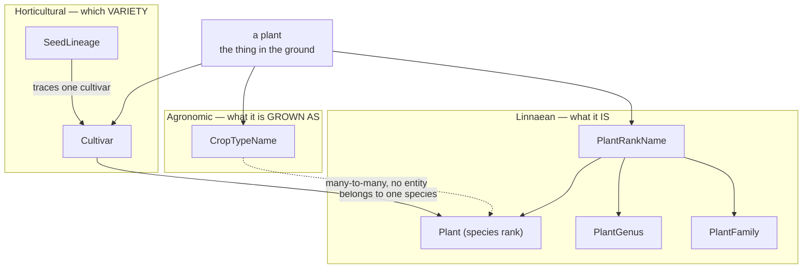
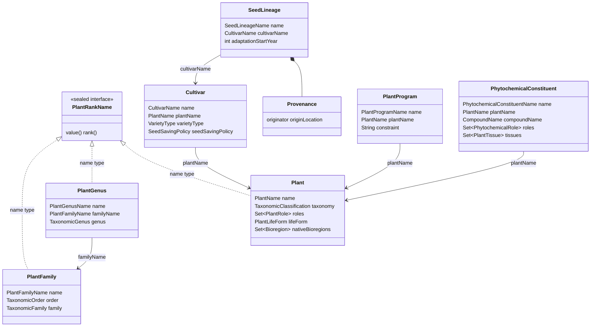
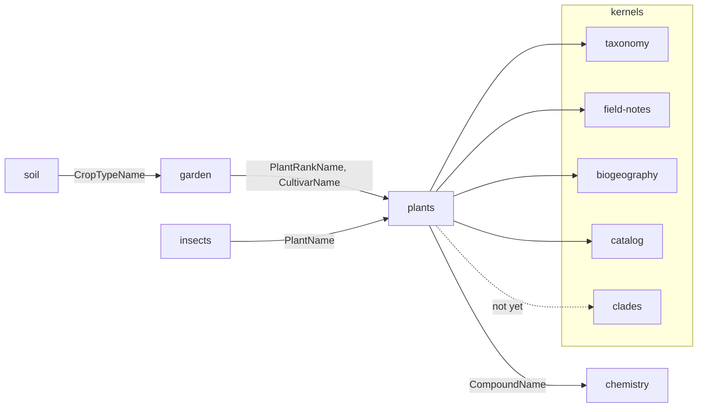

# Plants — Ubiquitous Language

What the plants domain means by its terms, and how they relate to the rest of the system
**as of today**. Structural conventions live in [`../CLAUDE.md`](../CLAUDE.md); narrative
and ecological context in [`docs/briefings/plants-domain.md`](../../../docs/briefings/plants-domain.md).

Builds on two kernel languages — read those first if the rank or clade vocabulary is
unfamiliar:

- [`kernels/taxonomy/docs/taxonomy-ubl.md`](../../../kernels/taxonomy/docs/taxonomy-ubl.md) — Linnaean rank
- [`kernels/clades/docs/clades-ubl.md`](../../../kernels/clades/docs/clades-ubl.md) — evolutionary placement

---

## 1. What makes plants different: three classifiers, not one

Insects classifies an organism one way — by Linnaean rank, with clade as a second,
purely evolutionary axis. **Plants needs three**, because a cultivated plant is described
differently depending on who is asking.

**Linnaean** answers *what it is*: `Aristolochia californica`. Botany. Owned here.
**Horticultural** answers *which variety*: `amish-paste`. Breeding and seed-saving. Owned
here.
**Agronomic** answers *what it is grown as*: `tomato`. The unit a soil lab publishes
requirements for. Named here, **modelled in garden**.

None reduces to another. *Brassica oleracea* is one species and five crop types; "squash"
is one crop type across three *Cucurbita* species; Amish Paste is one cultivar of one
species that is one crop type. The three axes cross.

**Cultivar is not a rank.** It sits within a species, not below it on the ladder — which is
why `PlantRankName` permits three Linnaean names and not `CultivarName`. Reasoning in
`docs/plans/organism-domain-blueprint.md` §D.

---

## 2. The language

| Term | Meaning | Code |
|---|---|---|
| **rank record** | A taxon at family, genus or species rank — a permanent home, never a placeholder | `PlantFamily`, `PlantGenus`, `Plant` |
| **subject** | What a record is *about*, at whatever rank was resolved | `PlantRankName` |
| **cultivar** | A named selection within a species: breeding status, fruit type, seed policy | `Cultivar` |
| **seed lineage** | A cultivar's saved-seed history and adaptation program | `SeedLineage` |
| **provenance** | Originator, origin, generations — a lineage's pedigree | `Provenance` (ValueObject) |
| **program** | A standing rule or schedule attached to a plant, named for the *activity* | `PlantProgram` |
| **constituent** | One compound, in one plant, with the role it plays *there* | `PhytochemicalConstituent` |
| **phytochemical role** | Defensive, signalling, medicinal, commercial… | `PhytochemicalRole` (sealed, 22 permits) |

---

## 3. The types

Vocabularies (enums): `PlantRole`, `PlantLifeForm`, `VarietyType`, `FruitType`,
`SeedSavingPolicy`, `PhytochemicalCategory`, `PlantTissue`, `InductionMode`.

**Two gaps visible in the diagram, both tracked in
[the consistency plan](../../../docs/plans/2026-08-15-plants-domain-consistency-plan.md):**

1. `Plant` has **no typed link to `PlantGenus`** — its position is a
   `TaxonomicClassification` of strings, so the chain stops at genus and nothing enforces
   that a plant's genus exists (M2b).
2. `Plant` is named for the domain, not its rank — `PlantFamily`, `PlantGenus`, `Plant`.
   The rename to `PlantSpecies` / `PlantSpeciesName` is agreed and pending.

---

## 4. Relationships to other domains, today

| Edge | Carried by | Where |
|---|---|---|
| plants → chemistry | `CompoundName` | `PhytochemicalConstituent.compoundName` — the only edge crossing a *domain* boundary from here |
| plants → biogeography | `Bioregion` | `Plant.nativeBioregions` |
| garden → plants | `PlantRankName`, `CultivarName` | `Planting.subject`, `Planting.cultivarName` — two axes, two components |
| insects → plants | `PlantName` | `LarvaStage.hostPlants`, `AdultStage.nectarSources` |
| soil → garden | `CropTypeName` | `LabAnalysisInfo.cropType` — the agronomic axis, reached via garden |

Every edge is a typed name from `domains/identifiers`. No plants module imports another
domain's api, and no other domain imports `plants-api`.

**Reverse resolution** goes through the catalog kernel, not through imports:
`PlantCatalogContribution` (search) and `PlantCompoundReferences` (which plants produce
this compound) in `plants-core/catalog/`.

**Two edges want widening to `PlantRankName`** and are queued behind the rename: the
insects host-plant lists (a larval host known only to genus is the norm) and
`PlantProgram.plantName` (`citrus-bloom-pesticide-window` targets a genus).

---

## 5. Rank identification, as plants does it

The general strategy — catalogue at the most specific rank the evidence supports, treat
that record as permanent, materialise ancestors — is in
`docs/plans/organism-domain-blueprint.md`. Plants differs from insects in three ways
today:

| | insects | plants |
|---|---|---|
| Ranks with entities | order → subspecies (5) | family → species (3) |
| Typed upward chain | complete | breaks below genus (M2b) |
| Identification flow | vision + authority, rank-polymorphic | none — records are authored by hand |
| Clade placement | on every rank entity | not yet |

Plants has the *rank layer* but not the *identification process*. `PlantRankName` exists
so consumers can already attach at any rank — garden does — and so the process has
somewhere to land when it arrives.
