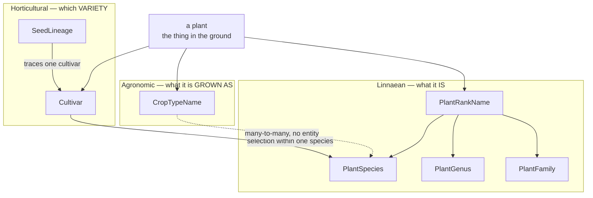
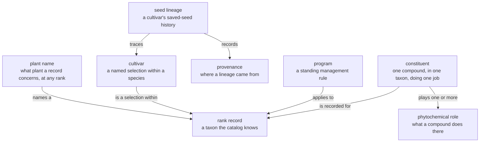
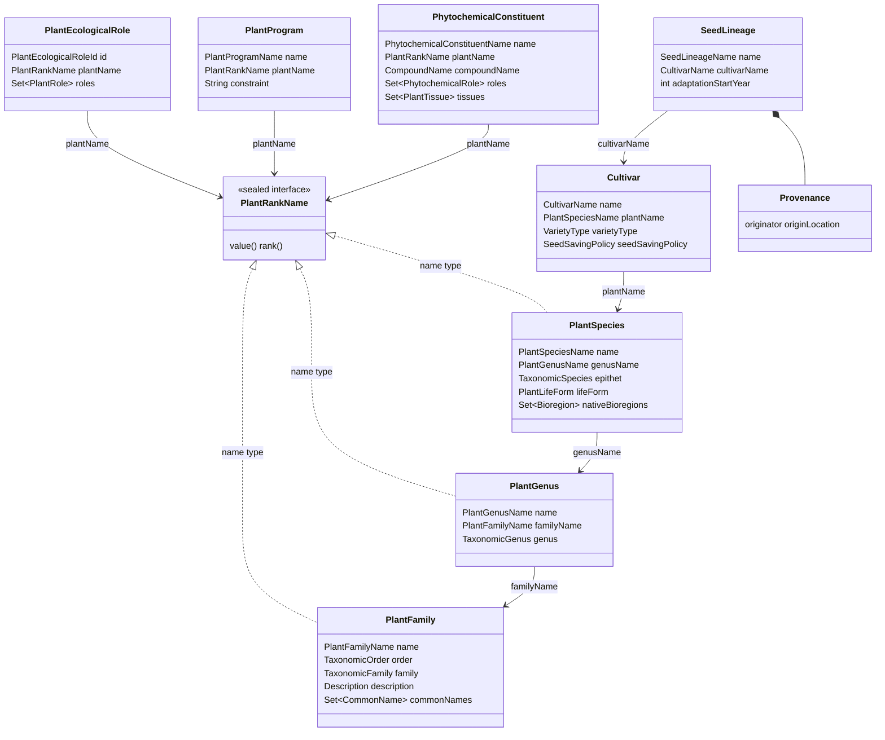
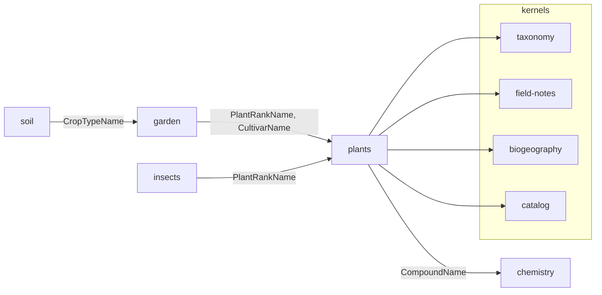

# Plants — Ubiquitous Language

The vocabulary of the plants domain: what its terms mean, how they relate, and where each
lives in code. This is the living definition of the model — read it as the shape plants
*is*, not as a snapshot. Structural conventions live in [`../CLAUDE.md`](../CLAUDE.md);
narrative and ecological context in
[`docs/briefings/plants-domain.md`](../../../docs/briefings/plants-domain.md).

Builds on two kernel languages — read those first if the rank or clade vocabulary is
unfamiliar:

- [`kernels/taxonomy/docs/taxonomy-ubl.md`](../../../kernels/taxonomy/docs/taxonomy-ubl.md) — Linnaean rank
- [`kernels/clades/docs/clades-ubl.md`](../../../kernels/clades/docs/clades-ubl.md) — evolutionary placement

> Where the code has not yet caught up to this model, the
> [consistency plan](../../../docs/plans/2026-08-15-plants-domain-consistency-plan.md)
> tracks the remaining work. The plan records the migration; this file records the meaning.

---

## 1. Three classifiers, not one

Insects classifies an organism one way — Linnaean rank, with clade as a second, purely
evolutionary axis. **Plants needs three**, because a cultivated plant is described
differently depending on who is asking.

**Linnaean** answers *what it is*: `Aristolochia californica`. Botany. Owned here.
**Horticultural** answers *which variety*: `amish-paste`. Breeding and seed-saving.
Owned here.
**Agronomic** answers *what it is grown as*: `tomato`. The unit a soil lab publishes
requirements for. Named here, **modelled in garden**.

None reduces to another. *Brassica oleracea* is one species and five crop types; "squash"
is one crop type across three *Cucurbita* species; Amish Paste is one cultivar of one
species that is one crop type. The three axes cross.

**Only the Linnaean axis is a ladder.** Cultivar sits *within* a species and crop type
cuts across species entirely — neither is a rung, which is why `PlantRankName` permits
three Linnaean names and nothing else. The general rule is in
`docs/plans/organism-domain-blueprint.md` §D.

---

## 2. The language

| Term | Meaning | Code |
|---|---|---|
| **rank record** | A taxon at family, genus or species rank. A permanent home at the rank the evidence supports — never a placeholder for a finer identification | `PlantFamily`, `PlantGenus`, `PlantSpecies` |
| **plant name** | What plant a record concerns, at whatever rank was resolved | `PlantRankName` |
| **cultivar** | A named selection within a species: breeding status, fruit type, seed policy | `Cultivar` |
| **seed lineage** | A cultivar's saved-seed history and adaptation program | `SeedLineage` |
| **provenance** | Originator, origin, generations — a lineage's pedigree | `Provenance` (ValueObject) |
| **program** | A standing rule or schedule attached to a taxon, named for the *activity* | `PlantProgram` |
| **constituent** | One compound, in one taxon, with the role it plays *there* | `PhytochemicalConstituent` |
| **phytochemical role** | Defensive, signalling, medicinal, commercial… | `PhytochemicalRole` (sealed, 22 permits) |

**`plantName` is the component name for any `PlantRankName` reference.** Asking "what
plant is this?" is answered by a name at whatever rank was resolved — *Carabidae* and
*Battus philenor* are both answers to "what is it?", and the same holds for plants. The
component names the role; the type carries the rank. There is no bare `PlantName` type
competing for the word, exactly as insects has no `InsectName`.

A reference typed `PlantSpeciesName` rather than `PlantRankName` is a deliberate
narrowing, and the specific type is how it says so.

---

## 3. The types

Vocabularies (enums): `PlantRole`, `PlantLifeForm`, `VarietyType`, `FruitType`,
`SeedSavingPolicy`, `PhytochemicalCategory`, `PlantTissue`, `InductionMode`.

Three things the diagram is asserting:

**The rank chain is typed end to end.** `PlantSpecies → PlantGenus → PlantFamily`, each by
a typed name with a foreign-key constraint behind it. Position is never carried as loose
epithet strings; a taxon's parent is a reference, not a description.

**Anything attaching to a taxon takes `PlantRankName`.** Programs, constituents and
ecological roles all attach at whichever rank the evidence supports, so a management rule
can target a genus and a compound can be recorded for one. `PlantEcologicalRole` is a
cross-rank entity rather than a component on each rank record — an organism identified
only to genus has ecological roles too.

**`lifeForm` stays on the species, not the genus.** A genus routinely spans life forms —
*Salvia* holds annuals and perennials, *Solanum* holds annual crops and perennial vines —
so asserting one on the genus record would be false more often than useful. Where a
demoted genus-rank taxon carried a life form, that assertion was dropped rather than
promoted; its ecological roles survive on `PlantEcologicalRole`.

**`Cultivar.plantName` is the one deliberate narrowing.** A cultivar is a selection within
a species; a cultivar of a whole genus is incoherent. Its upward reference is species-typed
precisely because the horticultural axis hangs off the species rung.

---

## 4. Relationships to other domains

| Edge | Carried by | Where |
|---|---|---|
| plants → chemistry | `CompoundName` | `PhytochemicalConstituent.compoundName` — the only edge crossing a *domain* boundary outward from here |
| plants → biogeography | `Bioregion` | `PlantSpecies.nativeBioregions` |
| garden → plants | `PlantRankName`, `CultivarName` | `Planting.plantName`, `Planting.cultivarName` — two axes, two components |
| insects → plants | `PlantRankName` | `LarvaStage.hostPlants`, `AdultStage.nectarSources` — a larval host known only to genus is the norm |
| soil → garden | `CropTypeName` | `LabAnalysisInfo.cropType` — the agronomic axis, reached through garden |

Every edge is a typed name from `domains/identifiers`. No plants module imports another
domain's api, and no other domain imports `plants-api`.

**Reverse resolution** goes through the catalog kernel rather than imports:
`PlantsCatalogContribution` (search) and `PlantsCompoundReferences` (which plants produce a
given compound), both in `plants-core/catalog/`.

---

## 5. Rank and identification

The cross-domain strategy — catalogue at the most specific rank the evidence supports,
treat that record as permanent, materialise ancestors — is in
`docs/plans/organism-domain-blueprint.md`. Plants' particulars:

| | Plants |
|---|---|
| Ranks with entities | family → genus → species |
| No order rank | Plants catalogues no `PlantOrder`; `TaxonomicOrder` is carried as an epithet on family and genus for self-sufficient display |
| No subspecies | `PlantSpeciesName` is the finest Linnaean rung; further specificity is expressed as a `Cultivar`, which is a different axis |
| Records | authored by hand, not by an identification service |

**A slug is honest about its rank.** `lamiaceae` is a family, `salvia` a genus,
`salvia-officinalis` a species. A binomial slug asserts species-level confidence, so a
plant known only to genus is a `PlantGenus` record — not a `PlantSpecies` with a vague
name. This is the same discipline an identification service applies at capture time,
applied by whoever authors the catalog.
