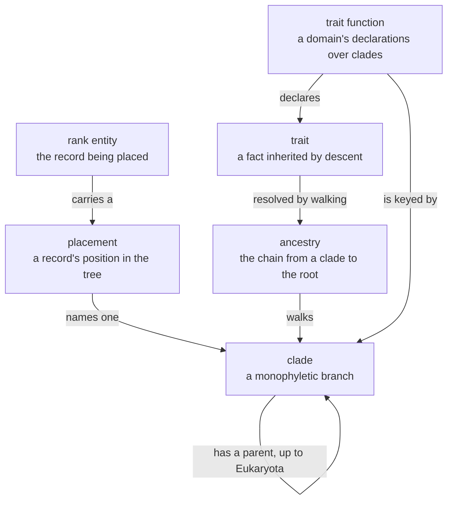
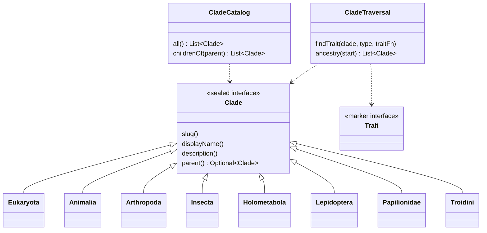

# Clades — Ubiquitous Language

The shared vocabulary for **evolutionary placement**: which branch of the tree of life an
organism descends from, and what that descent implies. A second axis over the same
records that carry a Linnaean rank — the two hierarchies do not derive from one another.

Source: `kernels/clades/src/main/java/com/naturalist/clades/`.

---

## 1. The language



**clade** — a branch of the tree of life, named and curated. Value-equal across every
domain, so two domains referring to `Holometabola` refer to the same node.
**placement** — a record's assertion that it descends from a clade. Nullable; unplaced is
a legitimate state.
**ancestry** — the chain from a clade up to `Eukaryota`.
**trait** — something true of an organism *because of* its descent. Owned by the domain,
never the kernel.
**trait function** — a pure `Function<Clade, Set<Trait>>` the consuming domain supplies.

---

## 2. The types



Seventeen permits today, all animal-side: `Eukaryota`, `Animalia`, `Arthropoda`,
`Insecta`, `Holometabola`, `Hemiptera`, `Blattodea`, `Termitoidae`, `Lepidoptera`,
`Papilionoidea`, `Papilionidae`, `Troidini`, `Apoidea`, `Anthophila`, `Drosophilinae`,
`DrosophilaSensuStricto`, `Sophophora`. **No plant clades exist yet** — adding them is a
deliberate kernel PR.

---

## 3. Why sealed records, not entities

The catalog is small and curated, and it needs *value-equal references to the same logical
node* across domains so trait inheritance works. It does not need repositories, write
paths or JSON seed. Sealed records give both, plus compile-time discoverability: open
`Holometabola.java` to see what Holometabola is. Rationale in `kernels/CLAUDE.md`.

---

## 4. Traits are domain-owned

The kernel declares no traits. A domain writes a pure switch and hands it to the traversal:

```java
// domains/insects/insects-api/.../InsectClades.java — the whole file is 3 cases and a default
public static Set<Trait> traitsFor(Clade clade) {
    return switch (clade) {
        case Holometabola _ -> Set.of(new MetabolyTrait(new Holometabolous()));
        case Hemiptera _, Blattodea _ -> Set.of(new MetabolyTrait(new Hemimetabolous()));
        default -> Set.of();
    };
}
```

Plants will declare its own function over its own clade nodes. The two coexist without a
registry because the clade *values* are value-equal.

---

## 5. Placement is orthogonal to rank

A rank entity carries both — `name` for its rung, `placedIn` for its branch:

```java
// domains/insects/insects-api/.../InsectSpecies.java
InsectSpeciesName name, ..., @Nullable Clade placedIn
```

Neither derives from the other, and they need not agree. This is the canonical example of
the axis pattern in `docs/plans/organism-domain-blueprint.md` §D.

---

## 6. Consumers today

| Domain | Uses |
|---|---|
| insects | `placedIn` + `withPlacedIn` on all four rank entities; `InsectClades.traitsFor`; console clade trail |
| library | Clade rank pages via the catalog bridge |
| plants | **None yet.** `plants-api` does not depend on `clades`; no plant clade permits exist |
