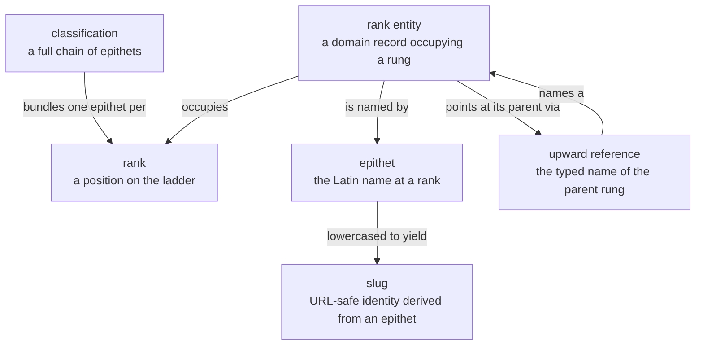
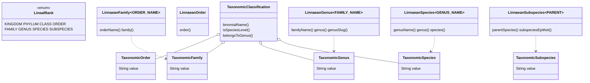

# Taxonomy — Ubiquitous Language

The shared vocabulary for **Linnaean rank**: where an organism sits on the classical
ladder, and how a domain declares that its records occupy a rung. Organism domains only
(insects, plants, arachnids, fungi, …); chemistry, soil, climate and sensors have no use
for it.

Source: `kernels/taxonomy/src/main/java/com/naturalist/taxonomy/`.

---

## 1. The language



**rank** — a rung: kingdom through subspecies. A closed ladder, declared complete.
**epithet** — the Latin name *at* a rank, capitalised as in the literature: `Lamiaceae`,
`Salvia`, `officinalis`. Not an identifier.
**classification** — a chain of epithets. Convenience for display and legacy records; it
is not identity and carries no reference.
**slug** — the lowercased epithet, used as an `EntityName` value. Derivation lives in
`TaxonomicSlugs`.
**rank entity** — a domain record that *is* a taxon at one rung, e.g. `InsectGenus`.
**upward reference** — a rank entity's typed parent name. This, not the classification, is
what makes the chain traversable.

---

## 2. The types



| Term | Type | Notes |
|---|---|---|
| Rank ladder | `LinealRank` | Ordinal order = increasing specificity, so a rank transition can be constrained to move *down* |
| Epithet | `Taxonomic{Order,Family,Genus,Species,Subspecies}` | `NamedValue<String>`, each with its own `isValid()` |
| Rank contract | `Linnaean{Order,Family,Genus,Species,Subspecies}` | Generic over the *parent's* name type — the kernel never knows a domain's name classes |
| Chain of epithets | `TaxonomicClassification` | Nullable genus and species, permitting family-level identification |

---

## 3. How a domain uses it

A rank entity implements the matching `Linnaean*` contract and supplies its own typed
names. The kernel supplies the shape; the domain supplies the identity.

```java
// domains/plants/plants-api/.../PlantGenus.java
public record PlantGenus(PlantGenusName name, PlantFamilyName familyName, ...)
        implements NamedEntity<PlantGenusName>, LinnaeanGenus<PlantFamilyName>
```

The generic parameter is the **parent's** name type, which is what keeps the kernel free
of any domain's vocabulary while still typing the upward link.

---

## 4. Two cautions

**`TaxonomicClassification` is not identity.** It bundles epithets as strings and enforces
no referential integrity. A record whose only link to its parent is a classification has no
traversable chain — see the plants UBL for a live case.

**The ladder is closed; what a domain catalogues is not.** `LinealRank` declares all eight
rungs, but a domain gives entities only to the rungs it needs — insects five, plants three.
Concepts that are *not* rungs (cultivar, clade, crop type) never become rungs; see
`docs/plans/organism-domain-blueprint.md` §D.

---

## 5. Consumers today

| Domain | Uses |
|---|---|
| insects | All five `Linnaean*` contracts; `InsectRankName` over the five names |
| plants | `LinnaeanGenus` on `PlantGenus`; `TaxonomicClassification` on `Plant`; `PlantRankName` over three names |
| clades kernel | None — clade placement is a separate axis, not a rank |
